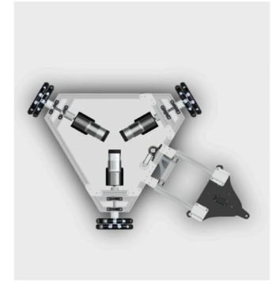

# Robotics Summer Project 2025-26

  
  
  
  

    
     
  

## 🤖 Project Overview

This repository houses the codebase for the **3 Wheel Drive System with Odometry**. It serves as a comprehensive collection of resources including code, CAD models, calculations, and component datasheets. Our aim is to create a well-documented reference that will enable future teams to build upon our work.

### 🎯 Design Goals
- ✅ Good design (with proper deadwheels)
- ✅ Efficient movement capabilities
- ✅ Precise odometry
- ✅ Omnidrive with high-speed motors

## 🧠 Algorithm Development
Kinematics of the drive have been solved extensively, and odometry calculations are also available. 
Both of these will be implemented.

## ⏱️ Project Timeline
The project timeline is divided into two halves:
1. <h3>Remote Based Drive with Odometry</h3>
2. <h3>Coordinate Based Drive using Odometry</h3>
A detailed breakup of these shall be discussed internally.

## 📚 Resources

### Tools and References 
- [Kinematics of 3 Wheeled Omnidrive](https://youtu.be/-wzl8XJopgg?si=YZAKnEMM0LUhHZKF)
- [Intro to Closed Loop Control for motor speed](https://youtu.be/UR0hOmjaHp0?si=LzniFOmYVttuYbI_) 
- [Odometry calculations](https://youtu.be/ixsxDn_ddLE?si=gyDlhlBjWfkZdKBQ)

### Development Software
- Arduino IDE (C++)
- For further implementation, MATLAB or Python might be used.

## 🤝 Contributor Notes
- We follow the [standard Git workflow](https://www.geeksforgeeks.org/git-workflows-with-open-source-collaboration/) for collaboration
- Suggestions for improvement are welcome via **Issues** or Discussions.

---

